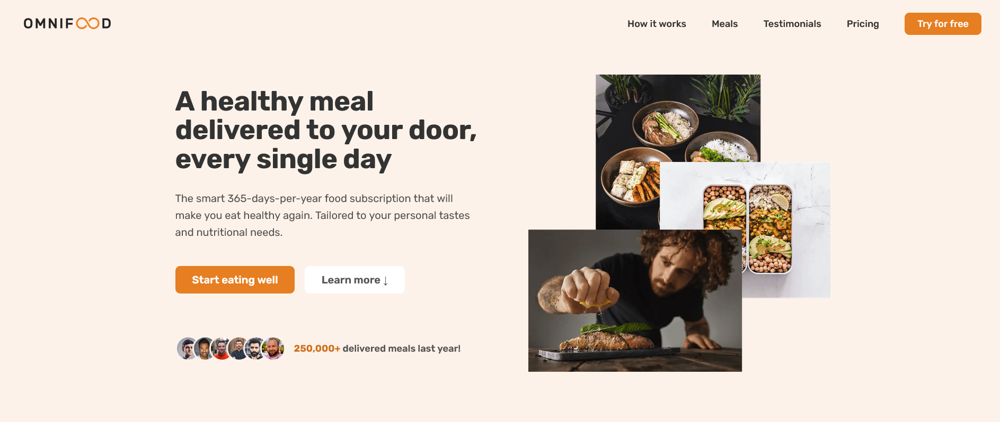
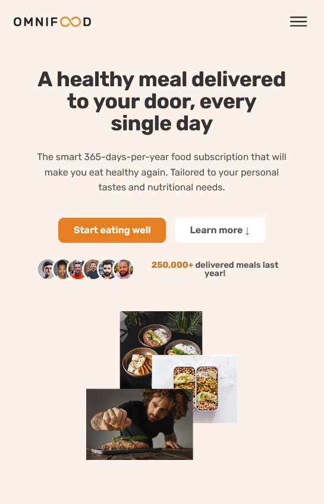

# Omnifood - food agency

## Table of contents

- [Overview](#overview)
  - [The challenge](#the-challenge)
  - [Screenshot](#screenshot)
  - [Links](#links)
- [My process](#my-process)
  - [Built with](#built-with)

## Overview

### The challenge

Users should be able to:

- this is a food agency you should use the website to see meals and its ingredients
- see pricing and order

### Screenshot

. .

### Links

- Solution URL: [Solution URL](https://github.com/Mohammed-Abol-Fotouh/Product-preview-card-component-Frontend-Mentor)
- Live Site URL: [Live Site URL](https://mohammed-abol-fotouh.github.io/Product-preview-card-component-Frontend-Mentor/)

## My process

### Built with

- Semantic HTML5 markup
- CSS custom properties
- Flexbox
- Mobile-first workflow
- CSS Grid
